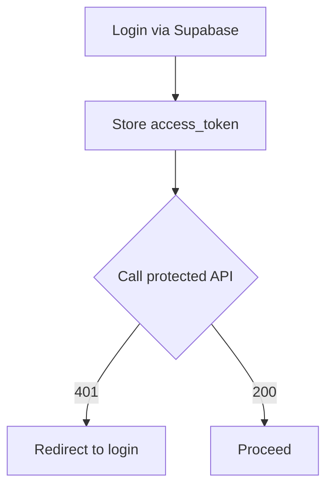
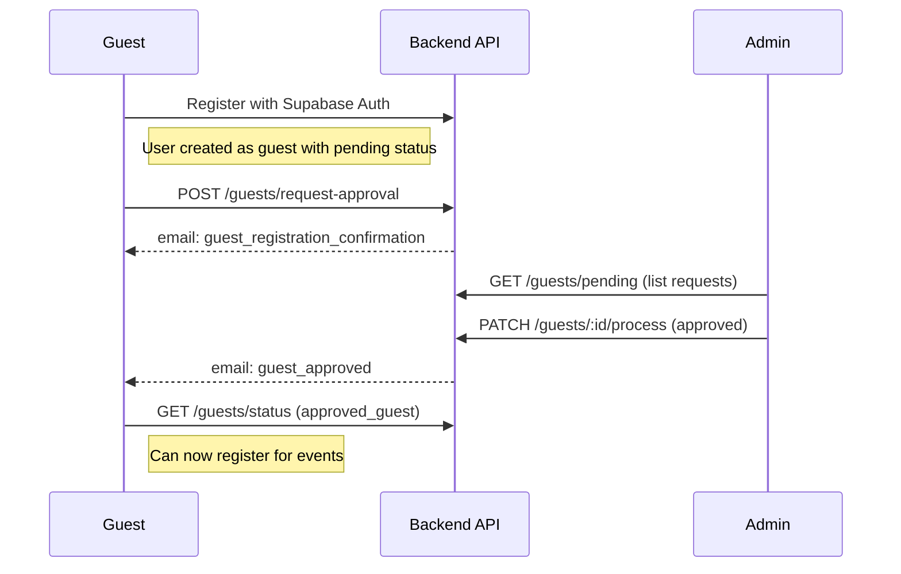
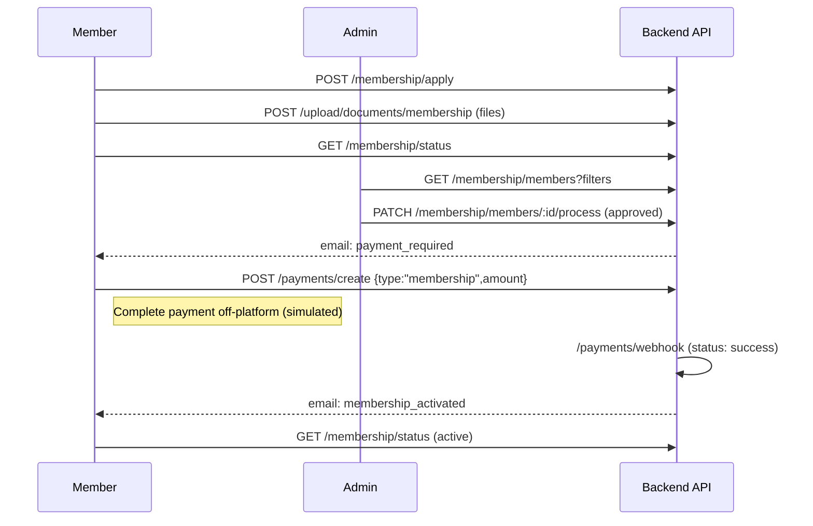
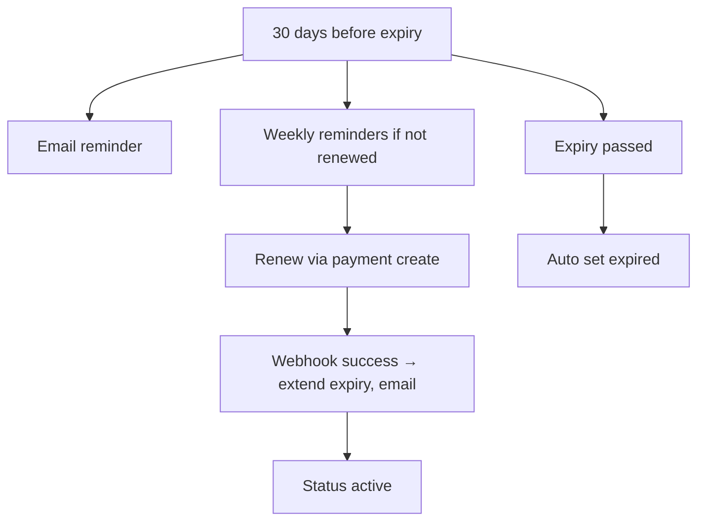

## Frontend Development Blueprint

### 1. Introduction
- Application: SLOA Membership & Event Portal (backend: Node.js/Express 5, Prisma, Supabase).
- Purpose: Manage member onboarding, renewals, event registration, file uploads, newsletters, analytics, data export, council governance, and audit logging.
- Audience: Members (trainee/consultant), Admin (single global admin recommended), Guests (public).
- Backend capabilities:
  - Auth: Supabase JWT; middleware expects Authorization: Bearer <token>.
  - Membership: application, admin decision, payment-driven activation, renewal reminders, auto-expiry.
  - Events: public browse, member registration, admin CRUD.
  - Files: uploads (membership docs, event poster/program), signed URLs.
  - Newsletter: public subscribe/unsubscribe, admin campaign send.
  - Analytics/export: admin-only analytics and CSV downloads.
  - Council: terms, positions, assignments (admin), president-only term/positions mgmt.
  - Audit logs: admin-only listing with filters.
- Constraints:
  - Express 5 routing; RBAC enforced server-side (admin checks).
  - Validation via Zod; pagination via string query params transformed to numbers.
  - Payments are simulated (webhook, pending→success/failed); webhook not signature-verified (front‑end should treat status as eventual).
  - One global admin recommended; not auto-granted via council positions.

### 2. User Personas
- Admin
  - Goals: Approve/reject applications, manage events/files/newsletters, view analytics/exports/audits, manage council, approve guest access.
  - Pain points: Avoid accidental destructive changes; need audit trails and filters.
  - Permissions: All admin endpoints.
  - Key features: Members list + process, events CRUD, file uploads, analytics/export, audit log viewer, council management, guest approval workflow, user sync management.
- Member (Trainee/Consultant)
  - Goals: Apply/renew membership, upload docs, register for events, manage profile, receive emails.
  - Pain points: Clear status visibility, renewal reminders, simple uploads.
  - Permissions: Authenticated member endpoints; some require active status.
  - Key features: Application, status, renewals, event registration, document upload.
- Approved Guest
  - Goals: Register for events, view event details, manage profile.
  - Pain points: Limited access compared to full members.
  - Permissions: Authenticated guest endpoints; requires approved_guest status.
  - Key features: Event registration, basic profile management.
- Pending Guest
  - Goals: Get approved for guest access, view public events, subscribe to newsletter.
  - Permissions: Public endpoints + guest approval request.
  - Key features: Guest approval request, events list, newsletter subscribe.

### 3. User Flows
#### 3.1 Authentication (Supabase JWT)
- Frontend: Supabase Auth (get access_token).
- API usage:
  - Send Authorization header on all protected routes: Authorization: Bearer <token>.
  - GET /api/v1/auth/me (if present) for profile snapshot (role, status).



#### 3.2 Guest Registration & Approval (No Payment Required)
- Guest:
  - POST /api/v1/guests/request-approval { fullName, reason? }
  - GET /api/v1/guests/status
- Admin:
  - GET /api/v1/guests/pending?search=&page=&limit=
  - PATCH /api/v1/guests/:id/process { status: "approved"|"rejected", note? }
  - GET /api/v1/guests/statistics



#### 3.3 Membership Application → Approval → Payment → Activation
- Member:
  - POST /api/v1/membership/apply { fullName, nic, specialization, hospital, role, cv?, documents? }
  - POST /api/v1/upload/documents/membership (multipart; files field "documents")
  - GET /api/v1/membership/status
- Admin:
  - GET /api/v1/membership/members?status=&role=&search=&page=&limit=
  - PATCH /api/v1/membership/members/:id/process { status: "approved"|"rejected", membershipId?, expiryDate? }
- Payment (member):
  - POST /api/v1/payments/create { type: "membership", amount, eventId? } → { paymentUrl }
  - Webhook (backend): POST /api/v1/payments/webhook { paymentId, status, gatewayRef? }
  - On success: backend sets user active, ensures membershipId, extends expiry, sends membership_activated email.



#### 3.4 Membership Renewal (with reminders)
- Scheduler (backend): emails at 30/7/1 days before expiry; weekly within 30 days; auto-expire on date.
- Member:
  - POST /api/v1/payments/create { type: "renewal", amount }
  - Webhook updates expiry on success.



#### 3.5 Event Management (with JSON Agenda Support)
- Public:
  - GET /api/v1/events?pagination
  - GET /api/v1/events/:id
- Approved Users (Members & Approved Guests):
  - POST /api/v1/events/:id/register (requires approved_guest or active status)
  - DELETE /api/v1/events/:id/register
  - GET /api/v1/events/user/registrations
- Admin:
  - POST /api/v1/events (create with agenda), PATCH /api/v1/events/:id, DELETE /api/v1/events/:id
  - GET /api/v1/events/:id/attendees

**Event Agenda Structure:**
Events now support structured agenda as JSON array:
```json
{
  "title": "SLOA Conference 2024",
  "agenda": [
    {
      "time": "09:00 AM",
      "topic": "Opening Ceremony",
      "speaker": "Dr. John Smith"
    },
    {
      "time": "10:30 AM",
      "topic": "Coffee Break",
      "speaker": "N/A"
    }
  ]
}
```

#### 3.6 User Synchronization (Admin Tools)
- Admin:
  - GET /api/v1/sync/status (overall sync health check)
  - GET /api/v1/sync/users/verify (verify user sync between Supabase Auth and database)
  - POST /api/v1/sync/users (sync all users from Supabase Auth)
  - DELETE /api/v1/sync/users/orphaned (cleanup orphaned users)
- Webhooks (Supabase):
  - POST /api/v1/webhooks/auth/user-created (automatic user sync)
  - POST /api/v1/webhooks/auth/user-updated (automatic user updates)

#### 3.7 Files
- Member docs: POST /api/v1/upload/documents/membership (files: documents[]; max 5)
- Admin event assets: POST /api/v1/upload/events/:eventId/poster|program
- Signed URL: GET /api/v1/upload/signed-url/:type/:filePath (type ∈ documents|events)

#### 3.8 Newsletter
- Public: POST /api/v1/newsletter/subscribe { email, name? }, GET /api/v1/newsletter/unsubscribe/:token
- Admin: POST /api/v1/newsletter/templates { name, subject, html, text? }, POST /api/v1/newsletter/send { subject, html }

#### 3.9 Analytics, Export, Audit
- Admin:
  - Analytics: GET /api/v1/analytics/* (dashboard, membership, events, revenue, activity)
  - Export: GET /api/v1/export/* (CSV)
  - Audit logs: GET /api/v1/audit?actorEmail=&action=&targetType=&from=&to=&page=&limit=

#### 3.10 Council
- Admin:
  - GET /api/v1/council/term/active
  - POST /api/v1/council/assign|remove (admin only; assigns/removes members to positions)
- President-only (guarded server-side):
  - POST /api/v1/council/term (create term)
  - POST /api/v1/council/positions (replace positions for a term; include one isPresident)
  - POST /api/v1/council/term/active (activate term)

### 4. UI/UX Guidelines (Backend-Informed)
- Validation (mirror Zod rules)
  - Login: email format, password min 6.
  - Guest approval request:
    - fullName: min 2
    - reason: optional string
  - Membership application:
    - fullName: min 2
    - nic: min 10
    - specialization: min 2
    - hospital: min 2
    - role: enum ["trainee","consultant"]
    - cv: optional string (min 50 chars if provided)
    - documents: array of URL strings (when passing URLs); uploads handled via multipart.
  - Event creation/update:
    - title: min 3
    - date: valid date string
    - time: HH:MM (24h regex)
    - location: min 2
    - posterUrl/programUrl: valid URL if set
    - agenda: optional array of agenda items
      - Each item requires: time (string), topic (string), speaker (string)
  - Payment create:
    - type: enum ["membership","renewal","event"]
    - amount: positive number
    - eventId: uuid if present
  - Params:
    - id, eventId: UUID
    - bucket type: enum ["documents","events"]
- Files
  - Size: MAX_FILE_SIZE (default 10MB)
  - Allowed types: ALLOWED_FILE_TYPES (default pdf,doc,docx,jpg,jpeg,png,webp)
  - Upload field names: "documents" (array), "poster", "program"
- Pagination
  - Query: page, limit as strings; default per route (often 10)
  - Admin lists return pagination payloads (membership/payments)
- Loading/error patterns
  - Show spinners for network calls; disable buttons during submission
  - Errors: show server message if present; otherwise generic fallback
  - Confirmation modals for destructive actions (delete event, process application)
- Accessibility/responsiveness
  - Semantic headings, labeled inputs, keyboard focus, ARIA live regions for async status
  - Mobile-first layouts; responsive tables with stacked rows on small screens
- Security UX
  - Always send Authorization header on protected calls
  - Hide admin actions for non-admin users; handle 403 gracefully
  - File input accept attribute matching allowed types

### 5. Suggested UI Layouts for Key Screens
#### 5.1 Login/Registration
Text wireframe:
- Header
- Email, Password
- Login button
- Forgot password
- Link to register

APIs:
- POST /api/v1/auth/login
- GET /api/v1/auth/me

#### 5.2 Member Dashboard
Text wireframe:
- Card: Membership Status (pending/active/expired/rejected)
  - If pending: "Awaiting approval"
  - If approved but payment pending: "Complete payment" → CTA
  - If active: expiry date + renew CTA if within 30 days
  - If expired: Renew CTA
- Card: Upload Documents → POST /upload/documents/membership
- Card: My Registrations → GET /events/user/registrations
- Section: Events → GET /events (list)

#### 5.3 Admin Dashboard
- Stats cards (from /analytics/dashboard)
- Tabs:
  - Guests
    - Pending requests → GET /guests/pending
    - Statistics → GET /guests/statistics
    - Approve/Reject → PATCH /guests/:id/process
  - Members
    - Filters: status, role, search, page, limit → GET /membership/members
    - Approve/Reject → PATCH /membership/members/:id/process
  - Events
    - List + Create/Edit/Delete with Agenda → POST/PATCH/DELETE /events
    - Upload poster/program → POST /upload/events/:eventId/*
    - Attendees → GET /events/:id/attendees
  - Payments
    - List → GET /payments/all
  - Analytics
    - Multiple charts → /analytics/*
  - Export
    - CSV downloads → /export/*
  - Audit
    - Table with filters → GET /audit
  - Council
    - Active term → GET /council/term/active
    - Assign/remove → POST /council/assign|remove (admin)
    - (President only) Create term / positions / set active
  - System Sync
    - Sync status → GET /sync/status
    - User sync tools → GET/POST /sync/users/*

#### 5.4 CRUD: Events
ASCII layout:
- Table: Title | Date | Registration Open | Actions [Edit/Delete/Attendees]
- Drawer/Modal for Create/Edit with fields:
  - Basic: title, date, time, location, description
  - Files: poster, program URLs
  - Agenda Builder: Dynamic form for time/topic/speaker items
    - Add/Remove agenda items
    - Drag & drop reordering (optional)
    - Time format validation

#### 5.5 Reporting/Analytics
- Filters (date range)
- Charts (cards/timeseries)
- Export buttons linking to /export/* endpoints

#### 5.6 Settings/Profile
- Profile editor
- Email preferences (newsletter)
- Danger zone (if any)

### 6. Data Mapping
- User (from GET /auth/me or membership status endpoint)
  - id, email, role ("guest","trainee","consultant","admin"), status ("pending","approved_guest","active","expired","rejected"), membershipId?
- Application (from members listing/status)
  - id, userId, role ("consultant"|"trainee"), documents[], status ("pending"|"approved"|"rejected"), appliedAt, approvedAt?, expiryDate?
- Event
  - id, title, description?, date, time, location?, posterUrl?, programUrl?, agenda?, isRegistrationOpen
  - agenda: Array<{ time: string, topic: string, speaker: string }>
- Registration
  - id, userId, eventId, registeredAt
- Payment
  - id, userId, type ("membership"|"renewal"|"event"), amount, status ("pending"|"success"|"failed"), gatewayRef?, createdAt

State variables:
- auth: token, user, role/status
- guest: approval status, request history
- membership: status, current application, expiry info
- events: list, pagination, selected, agenda items
- payments: list (admin), history (member)
- uploads: file queues, progress
- analytics/export: datasets, download links
- audit logs: items, filters, pagination
- council: active term, positions, assignments
- sync: user sync status, health checks (admin)

### 7. API Integration Notes
- Common
  - Base: /api/v1
  - Headers: Authorization: Bearer <token> for protected endpoints
- Guests
  - POST /guests/request-approval
    - Body: { fullName, reason? }
    - Errors: field validation (min lengths)
  - GET /guests/status (authenticated)
  - GET /guests/pending (admin)
  - PATCH /guests/:id/process (admin)
    - Body: { status: "approved"|"rejected", note? }
    - Side-effects: sends guest_approved/guest_rejected emails
- Membership
  - POST /membership/apply
    - Body: { fullName, nic, specialization, hospital, role, cv?, documents? }
    - Errors: field validation (min lengths, enums)
  - PATCH /membership/members/:id/process
    - Body: { status: "approved"|"rejected", membershipId?, expiryDate? (ISO date) }
    - Side-effects: sends payment_required email on approved
- Payments
  - POST /payments/create
    - Body: { type: "membership"|"renewal"|"event", amount, eventId? }
    - Response: { paymentUrl, payment }
  - POST /payments/webhook (server → server)
    - Body: { paymentId, status: "success"|"failed", gatewayRef? }
    - On success: user active, expiry extended, membership_activated email
- Events
  - GET /events? page&limit
  - POST /events; PATCH /events/:id; DELETE /events/:id
    - Body includes agenda: Array<{ time, topic, speaker }>
  - POST /events/:id/register; DELETE /events/:id/register (requires approved_guest or active)
  - GET /events/:id/attendees (admin)
- Files
  - POST /upload/documents/membership (multipart; field: documents)
  - POST /upload/events/:eventId/poster (field: poster), /program (field: program)
  - GET /upload/signed-url/:type/:filePath (auth)
- Newsletter
  - POST /newsletter/subscribe { email, name? }
  - GET /newsletter/unsubscribe/:token
  - POST /newsletter/templates { name, subject, html, text? }
  - POST /newsletter/send { subject, html }
- Analytics/Export/Audit
  - GET /analytics/* (admin)
  - GET /export/* (admin; CSV responses)
  - GET /audit?actorEmail=&action=&targetType=&from=&to=&page=&limit= (admin)
- Council
  - GET /council/term/active (auth)
  - POST /council/assign|remove (admin)
  - President-only in service: /council/term, /council/positions, /council/term/active
- Sync (Admin)
  - GET /sync/status (overall health check)
  - GET /sync/users/verify (check user sync)
  - POST /sync/users (sync all users from Supabase Auth)
  - DELETE /sync/users/orphaned (cleanup orphaned users)
- Webhooks (Supabase)
  - POST /webhooks/auth/user-created (automatic user sync)
  - POST /webhooks/auth/user-updated (automatic user updates)

Error handling patterns:
- 401: missing/invalid token
- 403: insufficient role or inactive status (for member-only actions)
- 400: validation errors; display error.message when available

### 8. Appendix
- Glossary
  - user.userRole: "guest"|"trainee"|"consultant"|"admin"
  - User.status: "pending"|"approved_guest"|"active"|"expired"|"rejected"
    - pending: newly registered, awaiting approval
    - approved_guest: approved for basic event access, no payment required
    - active: full member with payment completed
    - expired: membership expired
    - rejected: application rejected
  - Application.status: "pending"|"approved"|"rejected"
  - Payment.status: "pending"|"success"|"failed"
  - Event.agenda: Array<{ time: string, topic: string, speaker: string }>
  - CouncilTerm/Position/Member: governance models for annual roles
  - Audit log: records { actor, action, target, metadata, createdAt }
  - User Sync: synchronization between Supabase Auth and custom users table

This blueprint is derived from the provided backend code and Postman collection structure, aligning UI requirements with server behavior and validations.